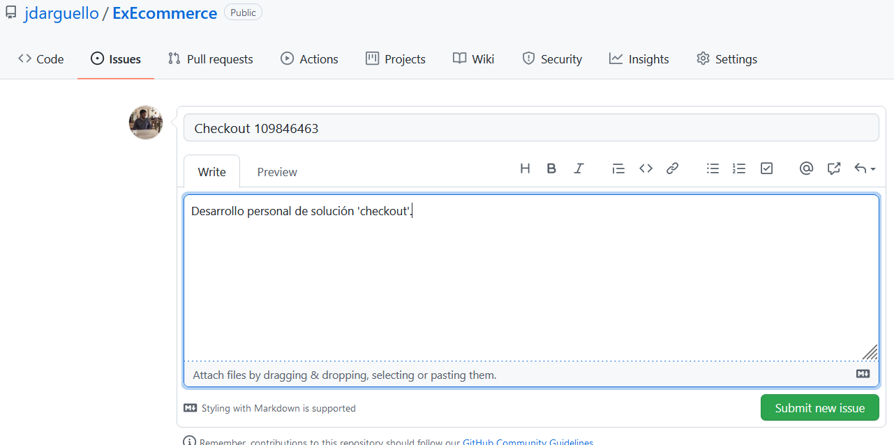
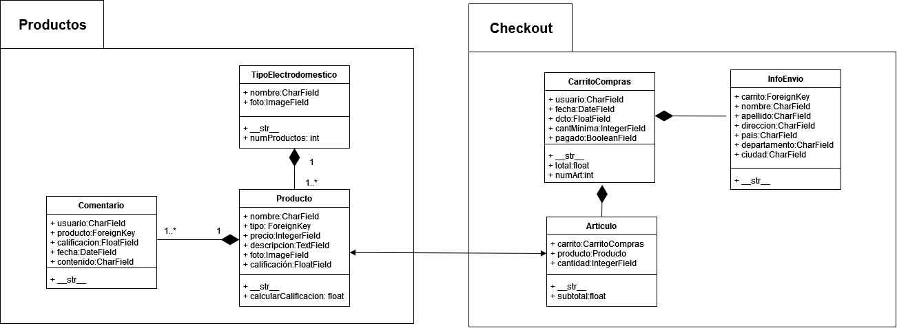

<div align="center">
    <h1>Taller 2</h1>
</div>

## Introducción

El presente taller se centra en repasar los siguientes conceptos:

* Trabajo con proyectos existentes.
* Creación de modelos CRUD.
* Uso, creación y adaptación de serializadores.
* Creación de API's.
* Trabajo con _forks_ y ramas de trabajo de individual.
* _Pull request_ e _issues_.

Para la solución del taller, debes tener en cuenta que cada punto es dependiente del anterior; por lo que deberás ir _paso a paso_.

El tema base de este taller será la lógica básica del __checkout__ de una plataforma de comercio electrónico enfocada en la venta de electrodomésticos.


## 1. Repositorio oficial

Puedes acceder al repositorio oficial de este taller haciendo click [aquí](https://github.com/jdarguello/ExEcommerce). En este repositorio debes hacer lo siguiente:

1. Crea un _issue_ personal tuyo en el proyecto. Debes titularlo: __"Checkout #cedula"__; por ejemplo: "Checkout 109846463".

<div align="center">



</div>

__No olvides escribir el número del _issue_ que acabas de crear para recordarlo, lo necesitarás más adelante__.

2. Crea una copia (_fork_) del proyecto en tu cuenta personal.

<div align="center">

 

</div>

## 2. Repositorio local

Ahora, crearás un clon del _repositorio oficial_, en la ubicación que desees, mediante el comando: `git clone https://github.com/jdarguello/ExEcommerce`

Dentro de la ubicación del repositorio local, ejecutarás los siguientes comandos:

1. `git remote add fork <url_fork>`. El `<url_fork>` se trata del url del repositorio copia que tienes en tu cuenta de GitHub.
2. `git checkout -b checkout_<cedula>`. Vas a crear una rama de trabajo personal. En `<cedula>` digitarás tu número de cédula. 

En este punto, ya estás listo para trabajar en el proyecto.

## 3. Aplicación _checkout_

Ahora, crearás una aplicación del proyecto django bajo el nombre __"checkout-#cedula"__. Es importante que coloques tu número de identificación para que al hacer el _pull request_ no haya conflicto al añadirlo al repositorio oficial. Recuerda también hacer la configuración en `settings.py`.

## 4. Modelos CRUD

Construye los modelos CRUD para el checkout de la plataforma. Puedes guiarte del diagrama UML. Recuerda que los modelos debes crearlos en `models.py`.



## 5. Serializadores

Construye los serializadores del proyecto. 

## 6. API's

Crea las API's con base en la información que deseas que tus usuarios observen en el frontend. Para el carrito de compras, ten en cuenta lo siguiente: en el momento en que se crea el `CarritoCompras`, no tenemos certeza de que el usuario ya lo haya pagado; por lo que es necesario actualizar el atributo `pagado` una vez haya pagado a través de la pasarela de pagos. Como es necesario actualizar información, no es recomendable utilizar `viewsets.ModelViewSet`, sino `viewsets.ViewSet`.

```PYTHON
from rest_framework import viewsets
from rest_framework.response import Response
from rest_framework.status import HTTP_400_BAD_REQUEST

from Checkout.serializers import *

class CarritoComprasAPI(viewsets.ViewSet):
    def list(self, request):
        carritos = CarritoCompras.objects.all()
        serializer = CarritoComprasSerial(carritos, many=True)
        return Response(serializer.data)
    
    def create(self, request):
        serializer = CarritoComprasSerial(data=request.data)
        if serializer.is_valid():
            carrito = serializer.save()
            return Response({'idCarrito':carrito.id})
        return Response(serializer.errors, HTTP_400_BAD_REQUEST)
    
    def partial_update(self, request, pk=None):
        carrito = self.get_object()
        data = {'pagado':True}
        serializer = CarritoComprasSerial(carrito, data, partial=True)
        if serializer.is_valid():
            serializer.save()
            return Response({'update':True})
        return Response(serializer.errors, HTTP_400_BAD_REQUEST)
```


Pero además, es recomendable tener en cuenta lo siguiente: cuando se crea el `CarritoCompras`, es porque el cliente ya ha elegidos __todos__ los artículos que desea comprar; por lo que si decides emplear `viewsets.ModelViewSet` el registro de cada artículo se hará de forma individual. Es decir, el frontend tendrá que hacer el registro de _un artículo a la vez_. Lo anterior no es práctico, por lo que deberíamos utilizar `viewset.ViewSet` para el registro de todos los artículos. Lo siguiente solucionaría este inconveniente:

```PYTHON
from rest_framework import viewsets
from rest_framework.response import Response
from rest_framework.status import HTTP_400_BAD_REQUEST

from Checkout.serializers import *

class ArticulosAPI(viewsets.ViewSet):
    def list(self, request):
        articulos = Articulo.objects.all()
        serializer = ArticuloSerial(articulos, many=True)
        return Response(serializer.data)
    
    def create(self, request):
        serializer = ArticuloSerial(data=request.data, many=True)
        if serializer.is_valid():
            serializer.save()
            return Response({'Creados':True})
        return Response(serializer.errors, HTTP_400_BAD_REQUEST)

```

El siguiente paso consiste en registrar en `urls.py` las direcciones de las API's creadas.

## 7. Pruebas

Siempre es recomendable hacer pruebas de los algoritmos para verificar su funcionalidad. Recuerda que dispones del `shell` y del servidor local para realizar estas pruebas.

## 8. Actualizar proyecto

Una vez hayas terminado, sube el contenido a tu repositorio copia de la siguiente forma:

1. `git add .`
2. `git commit -m "Fixes #<numIssue> <mensaje>`. El `<numIssue>` hace referencia al issue que abriste al principio del proyecto y el `<mensaje>` al mensaje adicional que desees escribir.
3. `git push fork checkout_<cedula>`. Recuerda que `checkout_<cedula>` corresponde al nombre de la rama de trabajo que estás utilizando. Para mirar las ramas de trabajo, sólo debes escribir `git branch`. En este punto, ya subiste el contenido a tu repositorio copia.
4. Dirígete a tu cuenta de GitHub, al repositorio copia y solicita un _pull request_.