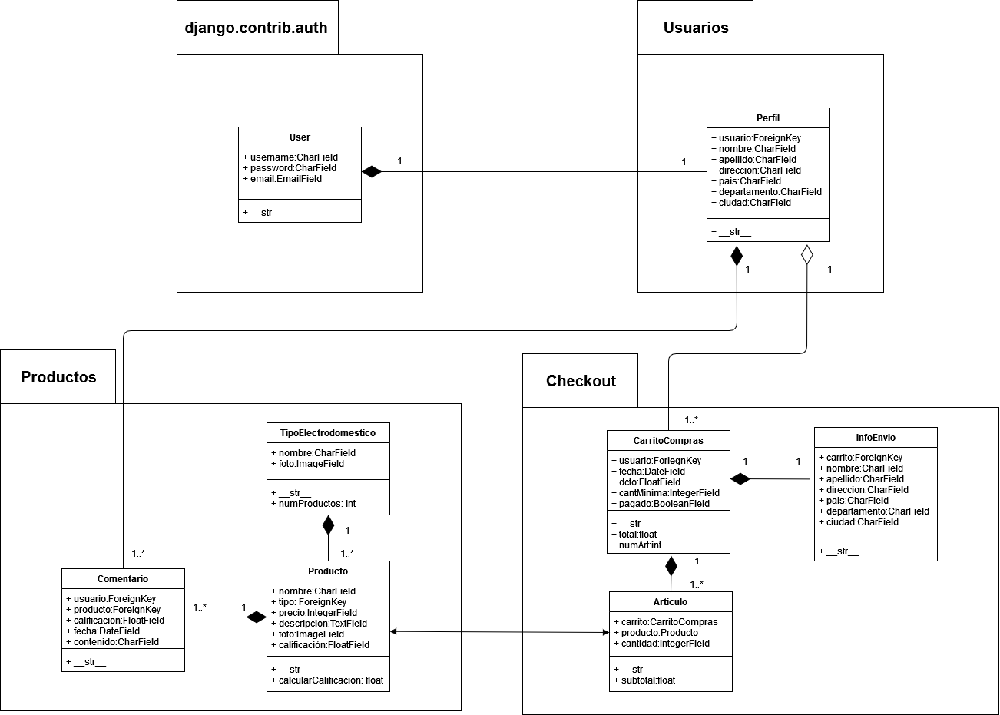

<div align="center">
    <h1>Taller 3 - Usuarios <i>django</i></h1>
</div>

## Introducción

En este taller aprenderemos:

* Cómo trabajar con el modelo de usuarios que trae django por defecto.
* Crear modelos que se basan en usuarios registrados.
* Crear serializadores que permitan crear usuarios.
* Crear API's con el modelo de usuarios.
* Elaborar un protocolo de autenticación por sesión para proteger información de usuario.

Para el desarrollo de este taller, trabajaremos con base en lo desarrollado en el Taller 2. Recuerda que para avanzar, debes ir _paso a paso_ en cada punto del taller, puesto que cada punto es dependiente del anterior.

## 1. Aplicación _Usuarios_

Lo primero que debemos hacer es crear la aplicación de usuarios. Para ello, debemos ejecutar el comando `python manage.py startapp Usuarios`.

## 2. Introducción _usuarios django_

Podemos utilizar el `shell` para hacer diferentes pruebas de los modelos de usuario por defecto de django. 

```PYTHON
In  [1]: from django.contrib.auth import get_user_model

In  [2]: User = get_user_model()

In  [3]: User.objects.all()
Out [3]:<QuerySet [<User: juand>, <User: jdarguello>]>

In  [4]: john = User.objects.create(username="john10", password="123", email="john10@")

In  [5]: john
Out [5]: <User: john10>

In  [6]: johnny = User.objects.create_superuser(username="johnny", password="123", email="johnny@")

In  [7]: johnny
Out [7]: <User: johnny>

```

## 3. Modelos CRUD

Elaboraremos los modelos de nuestra plataforma de comercio electrónico con base en los modelos descritos en el diagrama UML.



Una vez se tenga lista la clase Perfil, tendremos que corregir las conexiones establecidas en las anteriores aplicaciones.

## 4. Serializadores

En nuestros serializadores, crearemos uno para el modelo de usuario por defecto de django (`User`) y otra para el perfil de usuario: `Perfil`. Podemos utilizar la clase `ModelSerializer`. 

Sin embargo, para la clase `User` debemos tener una consideración adicional: por cuestiones de seguridad, nuestro serializador sólo debe permitir crear contraseñas, no mostrarlas. Para ello, aplicaremos el atributo `extra_kwargs` que nos permitirá realizar esta especificación, como se muestra a continuación.

```PYTHON
from rest_framework import serializers
from django.contrib.auth import get_user_model

class User (serializers.ModelSerializer):
    class Meta:
        model = get_user_model()
        fields = '__all__'
        extra_kwargs = {'password':{'write-only':True}}
```

## 5. Permisos de usuario

Para el acceso a la información del perfil de usuario, es necesario que el usuario esté autenticado y que el perfil sea de su pertenencia; es decir, que tenga permisos de acceso. Debido a ello, utilizaremos un proceso de autenticación por sesión, validado por usuario y contraseña, y crearemos un tipo de permiso especial para que los usuarios _sólo_ puedan acceder a su información, y no a la de otros usuarios. 

Lo primero que debemos hacer, es crear un nuevo archivo que llamaremos `permissions.py`. Allí, crearemos una clase que permita brindar permisos de usuario y darle acceso a un perfil siempre que este le pertenezca.

```PYTHON
from rest_framework import permissions

class AccesoPerfil (permissions.BasePermission):
    def has_object_permission(self, request, view, obj):
        if request.method in permission.SAFE_METHODS:
            return True
        return obj.id == request.user.id
```

## 6. API's

Para la creación de las API's utilizaremos la clase `ModelViewSet`; sin embargo, emplearemos como método de autenticación de usuario la contraseña por defecto y los como permisos: el hecho de que esté autenticado el usuario y que sea dueño del perfil.


```PYTHON
from rest_framework.response import Response
from rest_framework import viewsets
from rest_framework import authentication
from rest_framework.status import HTTP_400_BAD_REQUEST
from django.shortcuts import get_object_or_404

from Usuarios.serializers import *
from Usuarios.permissions import *

class UsuarioAPI(viewsets.ModelViewSet):
    authentication_classes = (authentication.SessionAuthentication,)
    permission_classes = (permissions.IsAuthenticated, AccesoPerfil)
    serializer_class = UserSerial
    queryset = get_user_model().objects.all()


class PerfilAPI (viewsets.ModelViewSet):
    authentication_classes = (authentication.SessionAuthentication,)
    permission_classes = (permissions.IsAuthenticated, AccesoPerfil)
    serializer_class = PerfilSerial
    queryset = Perfil.objects.all()
```

### 6.1. Registro de nuevos usuarios

Para permitir a nuestros usuarios crear un nuevo perfil, construiremos un formato de registro con base en un `APIView`. 

```PYTHON
from rest_framework.response import Response
from rest_framework import views
from rest_framework import authentication
from rest_framework.status import HTTP_400_BAD_REQUEST

from Usuarios.serializers import *

class RegisterAPI(views.APIView):
    def post(self, request):
        usuario = UserSerial(data=request.data)
        if usuario.is_valid():
            #¿Información válida?
            usuario.save()
            return Response({"Bienvenido": False})
        return Response(usuario.errors, HTTP_400_BAD_REQUEST)
```

### 6.2. Login

Para permitir a nuestros usuarios hacer un _login_, deben cumplir un protocolo de autenticación por contraseña. Para ello, implementaremos:

```PYTHON
from rest_framework.response import Response
from rest_framework import views
from django.contrib.auth import authenticate, login

class LoginAPI(views.APIView):
    def post(self, request):
        usuario = authenticate(request, username=request.data['username'], password = request.data['password'])
        if not usuario is None:
            login(request, usuario)
            return Response({"Bienvenido": True})
        return Response({"Bienvenido": False})
```

### 6.3. Logout

Para que nuestros usuarios puedan cerrar sesión, habilitaremos un _logout_ de sesión con permisos de autenticación.

```PYTHON
from rest_framework.response import Response
from rest_framework import views
from rest_framework import authentication
from django.contrib.auth import logout

from Usuarios.serializers import *
from Usuarios.permissions import *

class LogoutAPI(views.APIView):
    authentication_classes = (authentication.SessionAuthentication,)
    permission_classes = (permissions.IsAuthenticated, AccesoPerfil)
    def get(self, request):
        logout(request)
        return Response({"Adiós":True})
```

### 6.4. urls

Sólo nos falta agregar los urls:

```PYTHON
from django.urls import path, include
from rest_framework.routers import DefaultRouter 

from Usuarios.views import *

router = DefaultRouter()
router.register('users', UsuarioAPI)
router.register('perfil', PerfilAPI)

urlpatterns = [
    path('crud/', include(router.urls)),
    path('register', RegisterAPI.as_view()),
    path('login', LoginAPI.as_view()),
    path('logout', LogoutAPI.as_view())
]
```


